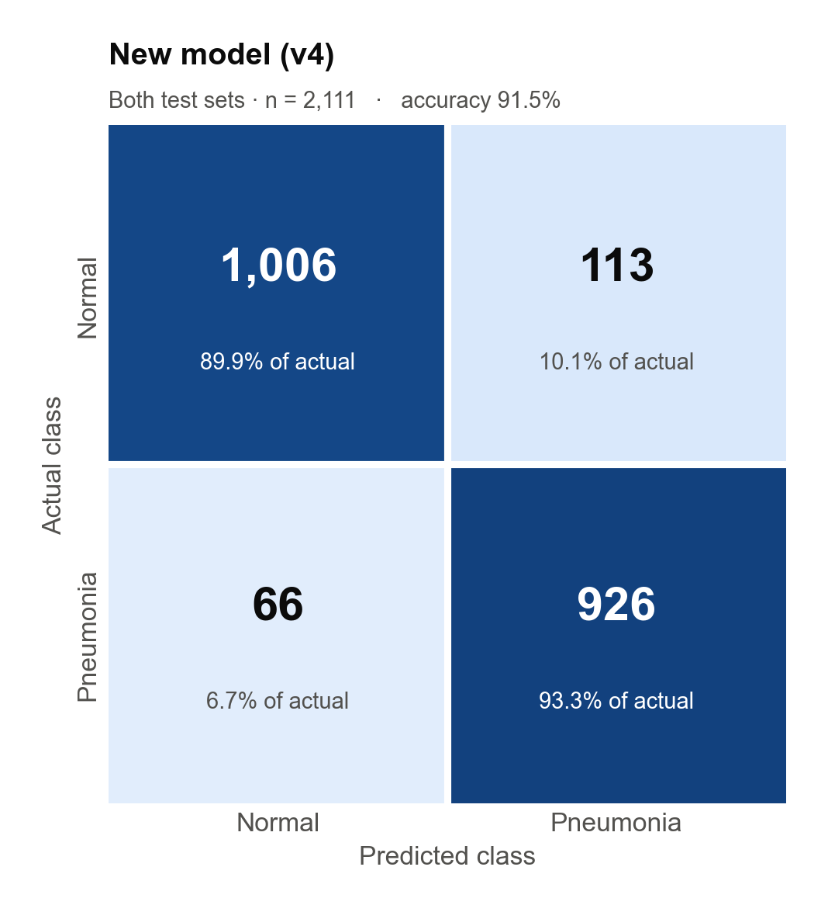
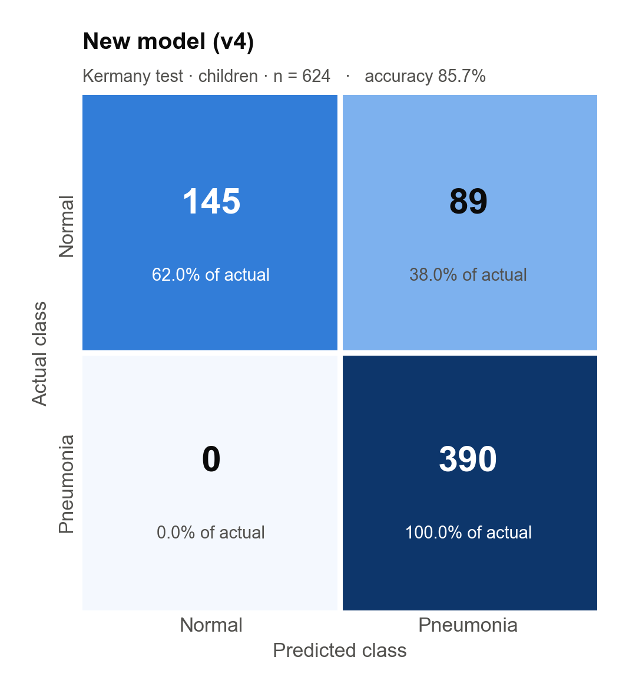
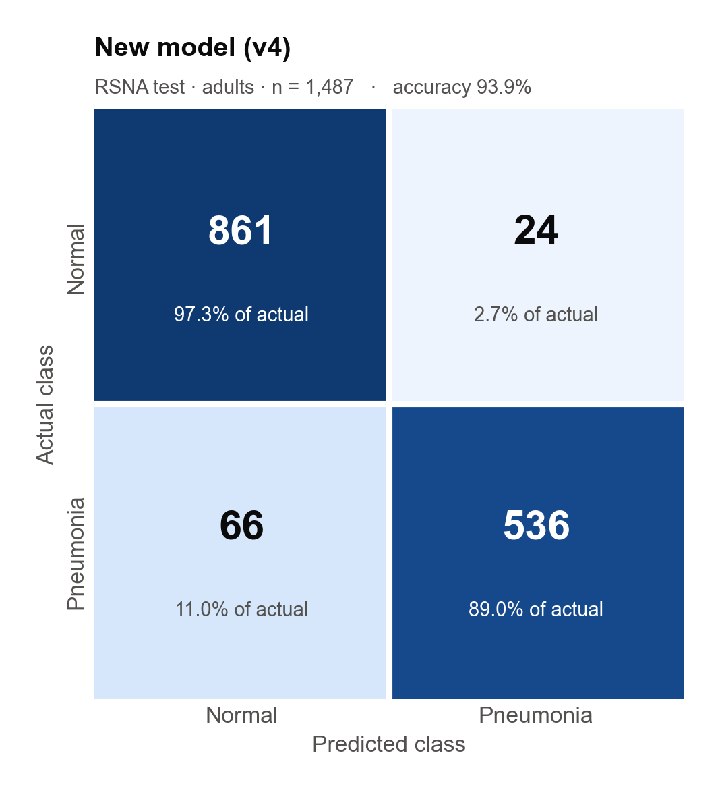

# Pneumonia Detection from Chest X-rays

A web app that analyzes a chest X-ray and says whether it shows **pneumonia** or looks **normal**, with a confidence score.

It uses a deep learning model (**EfficientNetB0**, transfer learning) trained on two public datasets: **Kermany** (pediatric X-rays) and **RSNA** (adult X-rays).

> ⚠️ This is a research and educational tool that assists diagnosis. It is **not** a replacement for a doctor.

## Features

- **Single diagnosis**: upload one X-ray and get the result, confidence and severity estimate, plus a printable report.
- **Batch analysis**: analyze many X-rays at once, with summary statistics and CSV export.
- **Compare**: analyze two X-rays side by side.
- **Model info**: shows the model's test results.
- Optional image enhancement (CLAHE).
- Arabic interface (right-to-left) with an English toggle.

## Results

On 2,111 held-out test images the model had never seen:

| Test set | Images | Accuracy | Sensitivity | Specificity | AUC |
|---|---|---|---|---|---|
| Kermany (children) | 624 | 85.7% | 100% | 62.0% | 0.963 |
| RSNA (adults) | 1,487 | 93.9% | 89.0% | 97.3% | 0.985 |
| **Combined** | **2,111** | **91.5%** | **93.3%** | **89.9%** | — |

### Confusion matrices

<p align="center">
  
  
  
</p>

## Tech stack

- **Model**: TensorFlow 2.20 / Keras 3.12, EfficientNetB0 fine-tuned on about 16,000 training images
- **Backend**: Python, Flask (REST API)
- **Frontend**: a single HTML/CSS/JavaScript page
- **Training**: Google Colab with a GPU (`train_colab.ipynb`)

## Run it locally

Requires **Python 3.10 or newer**.

```bash
python3 -m venv venv
source venv/bin/activate        # on Windows: venv\Scripts\activate
pip install -r requirements.txt
python app.py
```

Then open http://localhost:5000.

## API

| Endpoint | Method | Description |
|---|---|---|
| `/api/predict-single` | POST | One image (form field `file`, optional `enhance=true`) |
| `/api/predict-multiple` | POST | Several images (form field `files[]`) |
| `/api/compare` | POST | Two images (form fields `file1`, `file2`) |
| `/api/model-info` | GET | Model details and test results |
| `/api/health` | GET | Server status |

## Project structure

```
app.py                  Flask server and prediction logic
templates/index.html    Web interface
models/v4/              Trained model and its config (threshold, test results)
train_colab.ipynb       Training notebook for Google Colab
figures/                Confusion matrices
requirements.txt        Python dependencies
```

## Datasets

- [Chest X-Ray Images (Pneumonia): Kermany et al.](https://www.kaggle.com/datasets/paultimothymooney/chest-xray-pneumonia)
- [RSNA Pneumonia Detection Challenge](https://www.kaggle.com/competitions/rsna-pneumonia-detection-challenge)
